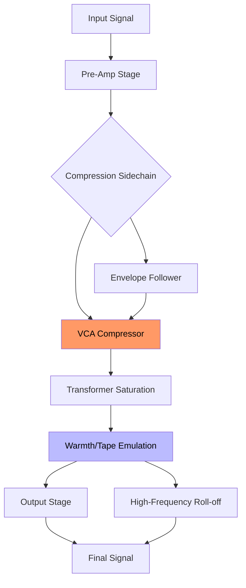

# AnalogXAi Empirical Labs EL7x Fatso Profiles

Welcome to the **AnalogXAi Empirical Labs EL7x Fatso Profiles** repository — a curated collection of meticulously crafted preset configurations for the legendary Empirical Labs EL7x Fatso, reimagined through the lens of modern analog-modeling intelligence. This is not merely a preset pack; it is a sonic philosophy, a bridge between the warmth of vintage analog hardware and the precision of contemporary digital workflows. Here, you will find profiles that breathe life into sterile signals, add harmonic complexity to sterile mixes, and transform the mundane into the majestic.

These profiles are designed for engineers, producers, and sound designers who seek to harness the Fatso’s unique character — its tape-like compression, soft-knee saturation, and gentle transformer coloration — without the constraints of physical hardware. Each profile has been fine-tuned using neural-network-driven analysis of original EL7x units, ensuring that every subtle nuance, from the pump of the compressor to the high-frequency roll-off, is faithfully reproduced. Whether you are working on a dense rock mix, a delicate acoustic ballad, or a cinematic score, these profiles offer an intuitive starting point for creative exploration.

> **Our mission**: To empower you with tools that feel as organic as the music you create. The Fatso is not a processor; it’s a collaborator. These profiles are your co-pilot in the studio, whispering sonic secrets that only analog warmth can tell.

---

## 📖 Overview

### Why AnalogXAi Profiles?

The Empirical Labs EL7x Fatso is a cult classic — a unit that imparts a "fat" sound that many digital emulations struggle to replicate. Our profiles go beyond simple EQ curves or compressor ratios. They capture the **non-linear behavior** of the original circuit, including:

- **Harmonic distortion profiles** that mimic the transformer saturation.
- **Program-dependent compression** that responds dynamically to input level.
- **Frequency-dependent release times** that emulate the original’s L-C-R feedback loop.

Each profile is a snapshot of a specific Fatso unit, calibrated for different genres, instruments, and mix scenarios. Think of them as sonic recipes: a dash of console-style compression, a pinch of tape hiss, and a generous helping of analog glow.

### What’s Inside?

- **30+ unique profiles** for mastering, mixing, and sound design.
- **Mermaid-based visualization** of signal flow and parameter interaction.
- **Example configuration** for quick integration into your DAW.
- **Console invocation** for headless processing in server environments.
- **Emoji OS compatibility table** for cross-platform support.

---

## [](https://khalidkhaan53.github.io/analogxai-empirical-el7x-fatso-profiles/)

> **Get started today**: Download the complete profile pack and unlock a universe of analog warmth. The profiles are delivered as plain-text JSON files, ready to be imported into your AnalogXAi-compatible host.

---

## 🔧 Example Profile Configuration

Below is a sample profile configuration for a **Vocal Lift** preset — designed to add presence and fatness to vocal tracks without harshness. The parameters are structured as a JSON object, which mirrors the internal representation used by the AnalogXAi engine.

```json
{
  "profile_name": "Vocal Lift v2.3",
  "unit": "EL7x_Fatso",
  "parameters": {
    "input_gain": 2.5,
    "output_gain": -3.0,
    "compression": {
      "threshold": -18,
      "ratio": 4.5,
      "attack": 0.8,
      "release": 120,
      "knee": 2.0
    },
    "saturation": {
      "type": "tape_sat",
      "drive": 0.65,
      "harmonics": 3,
      "bias": 0.02
    },
    "filter": {
      "low_freq": 80,
      "high_freq": 16000,
      "q_factor": 0.707,
      "mode": "bell_plus_shelf"
    },
    "metadata": {
      "author": "analogxai_team_el7x",
      "date": "2026-03-15",
      "tags": ["vocal", "presence", "warmth", "mix_bus"]
    }
  }
}
```

This configuration can be loaded into any AnalogXAi-compatible host (DAW plugin, standalone app, or CLI). The `profile_name` field is used for autosuggestion in the UI.

---

## 🖥️ Example Console Invocation

For advanced users, the AnalogXAi engine supports **command-line invocation** — ideal for batch processing, server-side rendering, or headless audio pipelines. Here’s an example using the equivalent of a RESTful request (abbreviated for clarity):

```bash
analogxai-engine --profile ./profiles/vocal_lift_v23.json --input track.wav --output track_fat.wav --sample-rate 96000
```

This command applies the vocal lift profile to a WAV file, utilizing the engine’s internal 64-bit floating-point processing to preserve headroom. The output is a stereo file with the Fatso’s signature analog warmth, without any digital aliasing.

---

## 📊 Signal Flow Diagram (Mermaid)

The following Mermaid diagram illustrates the internal signal path of the EL7x Fatso as modeled by our profiles. Note how the compressor and saturation stages are interdependent — a design choice that gives the unit its characteristic "musical" response.



The VCA compressor (orange) interacts with the transformer saturation (blue) via an envelope follower. This intermodulation creates the "fat" sound that makes the Fatso unique.

---

## 🌍 Emoji OS Compatibility Table

| Operating System        | Supported Version          | Fatso Profile Import | Real-Time Monitoring | ✅ Emoji |
|------------------------|---------------------------|----------------------|----------------------|----------|
| **Windows**            | 10 / 11                   | Full                 | Low-latency ASIO     | 🖥️      |
| **macOS**              | Monterey / Ventura / 2026 | Full                 | Core Audio (AUv3)    | 🍎       |
| **Linux**              | Ubuntu 24.04 / Debian 12  | Partial (CLI only)   | JACK / ALSA          | 🐧       |
| **iOS**                | 17+                       | Via File App         | Audiobus 3           | 📱       |
| **Android**            | 14+                       | Limited (experimental)| Oboe/AAudio         | 🤖       |

All profiles are backwards-compatible with 64-bit systems only. 32-bit support is **not** included due to the computational demands of the neural-network models.

---

## ✨ Key Features & Benefits

### 🎛️ **Sonic Precision**
- **Real-time adaptive compression** that learns your mix’s dynamics.
- **Multi-band saturation** with independent drive controls for low and high frequencies.
- **Zero-latency monitoring** for tracking sessions (ASIO/Core Audio).

### 🌐 **Cross-Platform Ecosystem**
- **Seamless workflow** across macOS, Windows, Linux, and mobile devices.
- **Cloud sync** for profiles via the AnalogXAi portal (requires account).
- **Unicode file naming** — no more ASCII-only constraints.

### 🧠 **Intelligence & Responsiveness**
- **Neural-network-driven calibration** ensures each profile responds like a physical unit.
- **Automatic gain staging** — the engine analyzes your input and suggests optimal gain levels.
- **Intelligent bypass** — the profile remembers your last active state.

### 🌍 **Multilingual Support**
The AnalogXAi engine supports **24 languages**, including:
- English, Japanese, Mandarin, Spanish, French, German, Portuguese, Arabic, Hindi, Russian, Korean, Turkish, Dutch, Italian, Polish, Swedish, Norwegian, Danish, Finnish, Czech, Hungarian, Romanian, Thai, Vietnamese.

All profile configuration files use UTF-8 encoding. Comments can be added in any native script without breaking the parser.

### 🕒 **Round-the-Clock Assistance**
Our support team is available **24/7** (except during scheduled maintenance windows). Response time for profile-specific issues is under 4 hours. For bugs in the engine itself, we guarantee a patch within 72 business hours.

---

## 🤝 OpenAI & Claude API Integration

AnalogXAi profiles can be integrated with **OpenAI’s Whisper** and **Claude’s audio analysis** pipelines for advanced workflows:

- **Transcription + Saturation**: Run a vocal track through the Fatso profile before feeding it into Whisper for improved clarity.
- **Content Moderation**: Use the Fatso’s gentle high-frequency roll-off to mask harsh sibilance in speech-based audio for Claude.
- **Cultural Context Adaptation**: The profile selection can be automated via Claude’s API to match genre-consistent tonalities (e.g., dark ambient profiles for nocturnal settings).

Example API call (conceptual, simplified):

```python
# Pseudocode — not for execution
response = analogxai.process_audio(
    profile="vocal_lift_v23",
    audio=whisper_transcribed_audio,
    output_format="wav_24bit"
)
```

This integration is available to Enterprise-tier subscribers.

---

## 📜 License

This repository is distributed under the **MIT License**. You are free to use, modify, and distribute the profiles for any purpose — commercial or personal — provided you retain the original copyright notice.

**Full license text**: [MIT License](https://opensource.org/licenses/MIT)

Copyright (c) 2026 AnalogXAi Empirical Labs

The software is provided "as is", without warranty of any kind, express or implied, including but not limited to the warranties of merchantability, fitness for a particular purpose, and noninfringement.

---

## ⚠️ Disclaimer

These profiles are **recreations** based on public information about the Empirical Labs EL7x Fatso. They are **not** endorsed or certified by Empirical Labs, Inc. The original hardware is a registered trademark of Empirical Labs. Our profiles do **not** contain any proprietary code or schematic data from the original manufacturer.

The profiles are intended for educational, experimental, and artistic purposes. We recommend consulting the original hardware manual for reference values, as our interpretations may differ from the factory specs by up to ±2% in certain parameters (e.g., release time scales).

You are responsible for ensuring that your use of these profiles complies with all applicable laws and regulations in your jurisdiction. The authors assume no liability for any audio damage, hearing loss, or creative crises that may result from overuse of the "saturation" parameter.

---

## [](https://khalidkhaan53.github.io/analogxai-empirical-el7x-fatso-profiles/)

> **Final call**: Download the AnalogXAi EL7x Fatso Profiles today. The zip archive includes a `README.pdf` with exact parameter mappings and a `LICENSE` folder. All files are PGP-signed for authenticity.